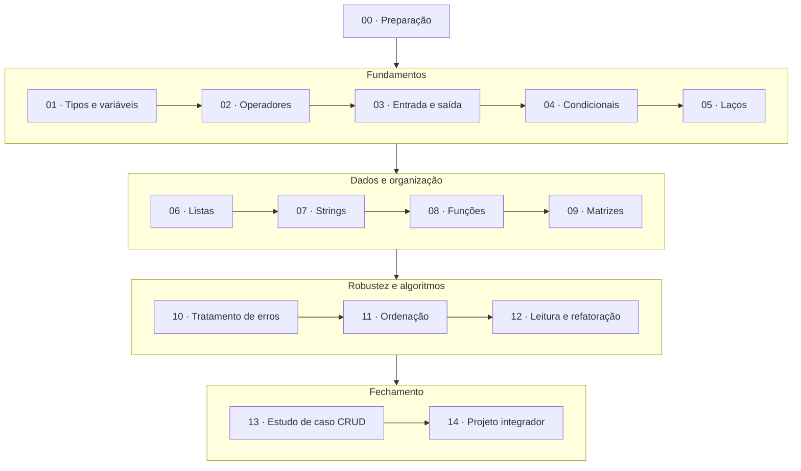

# Lógica de Programação com Python

Uma trilha de estudo do zero até um sistema completo, feita para ser percorrida **em ordem**. Cada
módulo é uma aula: a explicação mora no `README.md`, os exemplos rodáveis em `exemplos/` e os
enunciados em `exercicios/`. As respostas ficam em [gabaritos/](gabaritos/), longe dos enunciados,
de propósito.

**Nunca programou antes?** Comece pelo [Guia do aluno](GUIA-DO-ALUNO.md): instalar o Python, rodar
o primeiro arquivo e como estudar cada módulo.

---

## A trilha

---

## Módulos

| # | Módulo | O que você sai sabendo |
| --- | --- | --- |
| 00 | **[Preparação](modulo-00-preparacao/)** | instalar Python, usar o VS Code, rodar o primeiro `.py` |
| 01 | **[Tipos e variáveis](modulo-01-tipos-e-variaveis/)** | guardar valores e saber com que tipo de dado você está lidando |
| 02 | **[Operadores](modulo-02-operadores/)** | calcular, comparar e combinar condições |
| 03 | **[Entrada e saída](modulo-03-entrada-e-saida/)** | conversar com o usuário: `input`, `print`, f-strings e conversões |
| 04 | **[Condicionais](modulo-04-condicionais/)** | fazer o programa decidir, com `if/elif/else` e `match/case` |
| 05 | **[Laços de repetição](modulo-05-lacos-de-repeticao/)** | repetir sem copiar e colar: `while`, `for`, `range`, acumuladores |
| 06 | **[Listas](modulo-06-listas/)** | guardar muitos valores em uma variável só |
| 07 | **[Strings](modulo-07-strings/)** | tratar texto: buscar, fatiar, comparar e transformar |
| 08 | **[Funções](modulo-08-funcoes/)** | escrever uma vez e reaproveitar; parâmetros, retorno e escopo |
| 09 | **[Matrizes](modulo-09-matrizes/)** | listas de listas para representar tabelas e grades |
| 10 | **[Tratamento de erros](modulo-10-tratamento-de-erros/)** | impedir que uma digitação errada derrube o programa |
| 11 | **[Algoritmos de ordenação](modulo-11-algoritmos-de-ordenacao/)** | Bubble, Selection, Insertion e Quick Sort por dentro |
| 12 | **[Leitura e refatoração](modulo-12-leitura-e-refatoracao/)** | ler código dos outros e melhorar o seu sem quebrá-lo |
| 13 | **[Estudo de caso CRUD](modulo-13-estudo-de-caso-crud/)** | um sistema completo, comentado linha a linha |
| 14 | **[Projeto integrador](modulo-14-projeto-integrador/)** | seu próprio sistema, do enunciado à entrega |

---

## Além da trilha

| Pasta | Para que serve |
| --- | --- |
| [gabaritos/](gabaritos/) | resoluções comentadas de todos os exercícios |
| [banco-de-exercicios/](banco-de-exercicios/) | prática extra por nível, quando um módulo não bastou |
| [projetos/](projetos/) | jogos e calculadoras (desafios opcionais, e os mais divertidos) |
| [material-apoio/](material-apoio/) | [resumo de sintaxe](material-apoio/resumo-sintaxe.md), [guia de comentários](material-apoio/guia-de-comentarios.md) e [rubrica de avaliação](material-apoio/rubrica-avaliacao.md) |
| [apendice-padroes-de-projeto/](apendice-padroes-de-projeto/) | fora do escopo de lógica básica; só depois do módulo 14 |

Documentos de referência: [Guia do aluno](GUIA-DO-ALUNO.md) · [Glossário](GLOSSARIO.md)

---

## Como estudar

1. **Leia o README do módulo inteiro** antes de abrir qualquer `.py`. A aula está lá.
2. **Rode os exemplos na ordem numerada** e faça o *Experimento* que fecha cada arquivo. Mexer no
   código ensina o que ler não ensina.
3. **Faça os exercícios sem gabarito.** Vinte minutos travado valem mais que a resposta pronta.
4. **Marque a auto-avaliação** no fim do README. Caixinha em branco é sinal de voltar, não de seguir.

Um módulo por sessão de estudo. Dois no mesmo dia rende menos do que parece: o segundo depende do
primeiro estar assentado.

## Requisitos

Python **3.14 ou superior**. O mínimo absoluto para o material rodar é a 3.10, por causa do
`match/case` do módulo 04, mas instale a versão mais recente, que é a usada em aula.

Nenhuma biblioteca externa é necessária na trilha principal; a única exceção é o NumPy, opcional,
na seção "Para ir além" do módulo 09.

Como avaliar e ser avaliado: [rubrica de avaliação](material-apoio/rubrica-avaliacao.md).

---

## Sobre

Material de aula de lógica de programação, mantido por
[Mateus Redivo](https://github.com/Mateus-Redivo). Use, adapte e leve para a sua turma.
